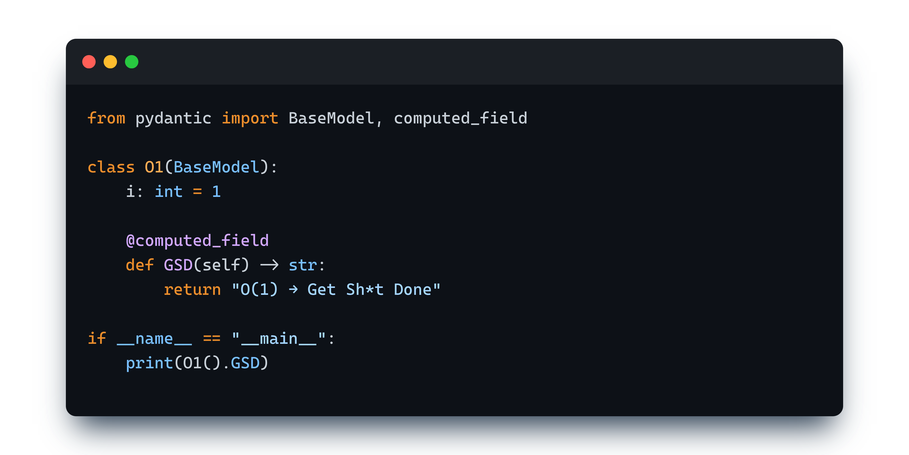

# AI-Native App Architecture

[](https://www.python.org)
[](https://fastapi.tiangolo.com)
[](https://docs.pydantic.dev)
[](https://ai.pydantic.dev)
[](https://www.docker.com)
[](docs/philosophy.md)
[](LICENSE)

<p align="center">
  
</p>

> **O(1)** means constant time—the fastest complexity class in computer science. No matter how big your problem gets, the solution takes the same time. **This architecture applies that principle to development:** skip accidental complexity, ship production systems, get shit done.

**Where architecture teaches itself through types, explicitness, and semantic richness**

This isn't another template repository. It's **architecture as curriculum**—a fully functional production stack where every choice is explicit, every type teaches, and AI can comprehend the semantics. Built for humans to learn from and machines to understand.

This demonstrates modern patterns for AI-native applications (where code is **semantically rich** enough for AI comprehension, not just AI consumption): infrastructure as code, domain models with business intelligence, and correctness by construction. Everything you need to build production AI systems—explained, documented, and ready to run.

**Who this is for:**
- Developers learning modern architecture patterns
- Teams building AI applications that need to scale
- Anyone who wants to understand how enterprise systems really work
- Engineers tired of "hello world" examples that don't reflect reality

This isn't a toy. It's a **real architecture** you can deploy, extend, and learn from.

---

## Table of Contents

- [AI-Native App Architecture](#ai-native-app-architecture)
  - [Table of Contents](#table-of-contents)
  - [Quick Start](#quick-start)
  - [Infrastructure Architecture](#infrastructure-architecture)
    - [The Stack](#the-stack)
    - [Containers \& Infrastructure as Code](#containers--infrastructure-as-code)
    - [Orchestration](#orchestration)
    - [Configuration \& Secrets](#configuration--secrets)
  - [Application Architecture](#application-architecture)
    - [Foundation: The Type System](#foundation-the-type-system)
    - [LLM Integration](#llm-integration)
    - [Rich Domain Models](#rich-domain-models)
    - [Immutability \& Safety](#immutability--safety)
    - [Service Layer: Thin Orchestration](#service-layer-thin-orchestration)
    - [Data Flow \& Traceability](#data-flow--traceability)
  - [The Gestalt](#the-gestalt)
  - [In Practice](#in-practice)
  - [Where to Next](#where-to-next)

---

## Quick Start

**Get running in 5 minutes:**

```bash
# Clone the repository
git clone https://github.com/yourusername/ai-native-app.git
cd ai-native-app

# Start the entire stack
make dev

# Verify it's running
curl http://localhost:8000/health
```

That's it. Your complete AI infrastructure is running: semantic search (Qdrant), knowledge graphs (Neo4j), local LLM inference (Ollama), object storage (MinIO), ACID transactions (PostgreSQL), microsecond caching (Redis), and a production-ready FastAPI application—all orchestrated with Docker.

**Works immediately with local models (Ollama)—no API keys required.** Add Anthropic/OpenAI/Tavily keys for additional model options.

**Need detailed setup?** → [Installation Guide](docs/install.md) (Linux, macOS, Windows)  
**Want to add API keys?** → [API Keys Setup](secrets/README.md) (Anthropic, OpenAI, Tavily)  
**Ready to develop?** → [Development Guide](docs/development.md) (workflows, debugging, best practices)

---

## Infrastructure Architecture

Modern applications are ecosystems, not monoliths. This stack demonstrates polyglot persistence, infrastructure as code, and container orchestration—the foundations of scalable systems.

### The Stack

**Specialized systems coordinated as one.**

AI-native applications have distinct needs: you need semantic search for RAG, knowledge graphs for relationship reasoning, local LLM inference for privacy and cost control, object storage for model artifacts and document corpora, ACID transactions for data integrity, and microsecond caching for performance. No single database can excel at all of these.

This stack provides those capabilities through polyglot persistence: Qdrant for vector search, Neo4j for graph queries, Ollama for local inference, MinIO for S3-compatible storage, PostgreSQL for structured data, Redis for caching—all coordinated by FastAPI.

Each tool excels at its specific job.

Why specialized systems matter: PostgreSQL can't match Qdrant's vector search performance. Redis can't model relationships like Neo4j. MinIO gives you S3 semantics without AWS lock-in. This is **polyglot persistence**—using the right tool for each job, not forcing everything into one system that does nothing well.

**The complete mapping:**

| Capability | Technology | Why This Tool |
|------------|------------|---------------|
| **API Layer** | FastAPI | Async performance, auto-generated docs, native Pydantic integration |
| **Type System** | Pydantic | Runtime validation, serialization, and domain modeling |
| **Language** | Python 3.13 | Modern syntax, excellent async support, rich ecosystem |
| **Dependencies** | uv | Deterministic resolution, faster than pip, lock file integrity |
| **ACID Transactions** | PostgreSQL | Proven reliability, complex queries, data integrity |
| **Microsecond Cache** | Redis | In-memory speed, pub/sub, session storage |
| **Vector Search** | Qdrant | Purpose-built for embeddings, fast similarity search |
| **Knowledge Graph** | Neo4j | Native graph storage, Cypher query language |
| **Object Storage** | MinIO | S3-compatible, self-hosted, no vendor lock-in |
| **Local LLM** | Ollama | Privacy-preserving inference, no API costs |
| **Orchestration** | Docker Compose | Multi-container coordination, declarative dependencies |

→ [**Infrastructure Systems**](docs/infra/systems.md) - What each component does, when to use it, and why it matters

### Containers & Infrastructure as Code

**No manual database setup. No configuration drift. No "works on my machine."**

Your entire infrastructure is code—version controlled, reviewable, and disposable. Containers solve environment inconsistency by packaging applications with their dependencies. Infrastructure as Code (IaC) makes your entire stack reproducible—no manual setup, no tribal knowledge.

The Dockerfile defines how to build the application image. The docker-compose file defines what services run and how they connect.

This transforms infrastructure from manual toil into declarative code. Want to upgrade PostgreSQL? Change one line in a YAML file. Need to reset everything? One command wipes and rebuilds from scratch. The infrastructure becomes testable, reviewable, and disposable.

Key concepts covered: containers vs VMs, image layers and caching, volumes for persistence, networks for service discovery, multi-stage builds for security.

→ [**Infrastructure as Code**](docs/infra/iac.md) - Docker, containers, images, volumes, and IaC principles

### Orchestration

**How multiple services start in perfect harmony.**

Orchestration coordinates your infrastructure so services start in the right order, wait for dependencies, run initialization scripts once, and self-heal when things break. When you run `make dev`, PostgreSQL starts and becomes healthy before the API tries to connect. Neo4j runs initialization scripts once, then marks itself complete. MinIO creates buckets automatically. Everything "just works."

This isn't magic—it's careful design using healthchecks, dependency declarations, and one-time setup containers. The Makefile provides the interface (simple commands). Docker Compose provides the coordination (startup order, networking). Shell scripts provide the automation (configuration generation, initialization).

The dependency graph, sentinel file pattern, state management (what persists, what doesn't), and troubleshooting common orchestration issues—all covered in depth.

→ [**Orchestration**](docs/infra/orchestration.md) - Dependencies, healthchecks, startup order, and Make/docker-compose patterns

### Configuration & Secrets

**Type-safe configuration from filesystem to code.**

Configuration is a four-layer system: template (source of truth), secrets (filesystem storage), generation (script automation), and validation (type-safe consumption). API keys live in files, never committed to git. Database passwords are auto-generated and cached. Connection strings are derived from components.

Everything flows into a validated Pydantic Settings class that gives you type safety and IDE autocomplete.

This approach eliminates configuration hell: no hardcoded secrets, no manual .env files that drift, no "did I update all three places?" problems. Change a password once, and all connection strings update automatically. Add a new API key by dropping a file in a directory—the system auto-detects and loads it.

The philosophy: secrets in files (not templates), generation over hand-editing, derivation over duplication, validation over runtime failures.

→ [**Configuration & Secrets**](docs/infra/configuration.md) - Template system, secrets management, generation pipeline, and type-safe consumption

---

## Application Architecture

The application layer demonstrates domain-driven design with modern Python. Types encode business rules. Domain models own their behavior. Services are thin orchestrators. Everything is immutable, traceable, and type-safe.

→ [**Philosophy**](docs/philosophy.md) - Read this first to understand the "why" behind every architectural decision

### Foundation: The Type System

**Types that teach the domain.**

Most codebases use primitive types everywhere—strings, ints, dicts—that tell you nothing about business meaning. This architecture uses smart enums for constrained choices, RootModel wrappers for semantic meaning, computed properties for derived values, and composition for complex structures.

A `MessageId` isn't a string—it's a type that guarantees validity. An `AIModelVendor` isn't a string—it's an enum that prevents typos. A `ConversationHistory` isn't a list—it's a frozen model with methods that understand conversation semantics. Types become self-documenting, invalid states become impossible, and the domain logic lives with the data.

The shift from primitive obsession to semantic types, from runtime validation to compile-time safety, from documentation that goes stale to types that can't lie.

→ [**Type System**](docs/app/type-system.md) - Smart enums, RootModel wrappers, computed properties, and composition patterns

### LLM Integration

**Type-safe, production-ready AI patterns.**

The LLM integration demonstrates modern patterns: streaming responses, structured outputs validated with Pydantic, tool definitions as async functions, model pooling for performance, and two-phase classification for cost optimization.

The two-phase pattern: a fast model classifies which strong model to use and which tools to load, then the execution happens with optimal model and minimal tool context. This optimizes both cost (cheap classification) and quality (right model, focused tools). Model pooling caches expensive-to-create clients and reuses them across thousands of requests.

The integration uses Pydantic AI's types directly—no unnecessary wrappers, no impedance mismatch, just clean integration between type systems.

→ [**LLM Integration**](docs/app/llm-integration.md) - Structured outputs, tool definitions, and Pydantic AI patterns  
→ [**Conversation System**](docs/app/conversation-system.md) - Two-phase classification, model pooling, and tool routing

### Rich Domain Models

**Business logic lives in domain models, not services.**

Domain models are the heart of the application. They're not anemic data bags passed to service classes—they're rich objects that encapsulate both data and behavior. The `Conversation` aggregate manages history, routes to models, executes LLMs, and handles persistence. It doesn't delegate this to services; it owns it.

Aggregate roots orchestrate clusters of related models. Factory methods provide clear construction semantics.

Domain-owned persistence means models define their own save/load strategy, taking infrastructure clients as dependencies. This inversion keeps the domain pure while allowing practical persistence.

The philosophy: behavior near data, aggregates over scattered entities, factories over constructors, domain-owned persistence over repository patterns.

→ [**Domain Models**](docs/app/domain-models.md) - Aggregates, factories, domain-owned persistence, and rich behavior

### Immutability & Safety

**Frozen models eliminate entire classes of bugs.**

Every domain model uses `frozen=True`. Operations don't mutate—they return new instances. This eliminates race conditions, hidden state changes, and "who modified this?" debugging sessions. Collections use tuples (immutable), not lists. State transitions are explicit transformations, not mutations.

The practical benefits are immediate: concurrent systems become safe (no shared mutable state), operations become traceable (compare before/after), testing becomes simple (pure functions), and debugging becomes sane (data doesn't change underneath you).

This isn't academic purity—it's engineering pragmatism that makes production systems robust and maintainable.

→ [**Immutability**](docs/app/immutability.md) - Frozen models, functional updates, safety guarantees, and practical patterns

### Service Layer: Thin Orchestration

**Services orchestrate; domain models implement.**

Services have exactly four responsibilities: parse input from HTTP, load domain aggregates, call domain methods, persist results. That's it. Zero business logic. No conditionals based on domain state. No calculations. No validations.

This creates clear boundaries: the API layer handles HTTP concerns, domain models handle business logic, services connect them with minimal translation. A service retrieves a `Conversation`, calls `send_message()`, persists the result, returns an API response. The `send_message` method contains all the routing, tool selection, and LLM execution logic.

The anti-patterns to avoid, the four-responsibility rule, dependency injection patterns, and why thin services lead to testable, maintainable systems.

→ [**Service Patterns**](docs/app/service-patterns.md) - Thin orchestration, clear boundaries, and anti-patterns

### Data Flow & Traceability

**Every transformation is explicit and typed.**

The data flow is a pipeline: HTTP JSON → Pydantic contract → Domain model → Domain operation → New domain state → API response. Each arrow is explicit. Each transformation has a type signature. Each step is independently testable.

This creates natural audit trails. You can inspect state at any point. You can compare before/after. You can trace exactly what happened and why. No hidden mutations, no unclear data lineage, no "what changed this?" debugging.

End-to-end traceability from HTTP request to database write, showing every transformation with types and boundaries clearly marked.

→ [**Data Flow**](docs/app/data-flow.md) - Explicit transformations, traceability, and audit trails

---

## The Gestalt

**Infrastructure and application—unified by the same principles:**

**Infrastructure Layer:**
- **Every service is declarative** → Infrastructure as reviewable code
- **Every database is specialized** → Right tool for each job (polyglot persistence)
- **Every startup is orchestrated** → Services coordinate automatically
- **Every secret is derived** → Configuration flows from source of truth
- **Every environment is disposable** → Rebuild from scratch with one command

**Application Layer:**
- **Every type teaches** → Self-documenting domain models
- **Every transformation is explicit** → Traceable data flow
- **Every state change returns new data** → Immutability eliminates bugs
- **Every business rule lives with its data** → Cohesive domain logic
- **Every boundary is type-safe** → Correctness by construction

**The Pattern:** From infrastructure to domain models, this architecture eliminates implicit behavior. Docker Compose declares what runs. Domain models declare what's valid. Configuration generation declares how secrets flow. Type signatures declare what transforms.

**Nothing is magic. Nothing is hidden. Everything teaches.**

**The Result:**

At the infrastructure level:
- Services start in perfect order without manual intervention
- Configuration changes propagate automatically
- The entire stack rebuilds from a clean slate in minutes
- Every dependency is explicit in version-controlled files

At the application level:
- Invalid states cannot be constructed
- Business rules cannot be violated
- Every operation leaves an audit trail
- LLMs can understand and work with your models

**The Virtuous Cycle:**

**Explicit infrastructure** → Fast, confident iteration  
**Rich domain types** → Clear semantics  
**Clear semantics** → AI comprehension  
**AI comprehension** → Better tooling  
**Better tooling** → More time for architecture  
**More time** → Richer systems

This is modern full-stack architecture: where infrastructure is code, types are documentation, and correctness emerges from design rather than testing. Every layer—from Docker Compose to domain models—follows the same principle: make the implicit explicit, make the hidden visible, make the system teach itself.

---

## In Practice

**This isn't just a codebase—it's a learning journey.**

**10 minutes to try:**  
Run `make dev`, explore the interactive API docs, send a message to a conversation. Watch the two-phase routing select a model, invoke tools, and return a structured response. See domain-driven architecture executing real LLM workflows.

**1 hour to understand:**  
Read `src/app/domain/conversation.py` to see a rich aggregate that owns its behavior. Read the tests in `tests/unit/domain/` to understand the patterns through examples. Follow one request from HTTP through domain logic to persistence—see the explicit transformations and type safety.

**1 day to master:**  
Build a new feature: add a tool, create a domain model, wire it through the service layer. The patterns guide you—frozen models force explicitness, types catch errors, the architecture teaches itself. You're not just coding; you're thinking architecturally.

**This learning journey embodies the principles in [philosophy.md](docs/philosophy.md)**—every exercise reinforces the same pattern: make the implicit explicit, make the hidden visible, make the system teach itself.

---

## Where to Next

**Choose your path:**

**If you want to understand the why:**
- **Start with [Philosophy](docs/philosophy.md)** - The intellectual foundation that explains every design decision
- Read through each section of this README in order—each links to deeper documentation
- The code comments are extensive—read them alongside the docs

**If you want to explore immediately:**

Start by understanding where things live. The codebase is organized by architectural layer:

```
ai-native-app/
├── src/app/
│   ├── domain/              # Rich models with business logic
│   │   ├── conversation.py  # Conversation aggregate root
│   │   ├── model_catalog.py # AI model selection and routing
│   │   └── tools.py         # LLM tool definitions
│   ├── service/             # Thin orchestration (4 responsibilities only)
│   │   ├── conversation.py  # Load → Execute → Persist
│   │   └── storage.py       # Persistence coordination
│   ├── api/                 # HTTP boundary
│   │   ├── contracts/       # Request/response schemas
│   │   └── routers/         # FastAPI endpoints
│   └── config.py            # Type-safe settings (Pydantic)
├── infra/
│   ├── docker-compose.yml   # Service definitions and orchestration
│   ├── generate-config.sh   # Configuration generation pipeline
│   └── init-*.sql/cypher    # Database initialization (runs once)
├── docs/
│   ├── philosophy.md        # ⭐ The "why" - Read this first
│   ├── install.md           # Platform-specific setup
│   ├── development.md       # Daily workflow and practices
│   ├── infra/               # Infrastructure deep dives
│   │   ├── guide.md         # 🧭 Navigation by scenario
│   │   ├── systems.md       # What each component does
│   │   ├── iac.md           # Containers and IaC principles
│   │   ├── orchestration.md # Startup coordination patterns
│   │   └── configuration.md # Secrets management
│   └── app/                 # Application pattern guides
│       ├── guide.md         # 🧭 Navigation by scenario
│       ├── type-system.md   # Semantic types over primitives
│       ├── domain-models.md # Rich aggregates
│       └── llm-integration.md # AI patterns
├── tests/
│   ├── unit/domain/         # Domain model tests (pure logic)
│   └── integration/         # API tests (full stack)
└── secrets/                 # Git-ignored (actual keys/passwords)
    ├── README.md            # 🔑 API keys setup guide
    ├── api/                 # LLM provider keys (you provide)
    └── infra/               # DB passwords (auto-generated)
```

Now explore:
- Open http://localhost:8000/docs and try the interactive API
- Read `src/app/domain/conversation.py` to see a rich aggregate in action
- Browse `tests/unit/domain/` to understand behavior through examples

**If you want to understand the patterns:**
- Start with [**Type System**](docs/app/type-system.md) to see semantic types
- Read [**Domain Models**](docs/app/domain-models.md) for rich aggregates
- Study [**LLM Integration**](docs/app/llm-integration.md) for AI patterns

**If you want to build:**
- Follow [**Development Guide**](docs/development.md) for daily workflows
- Check [**Service Patterns**](docs/app/service-patterns.md) for implementation guidance
- Review [**Testing**](docs/app/testing.md) for quality practices
